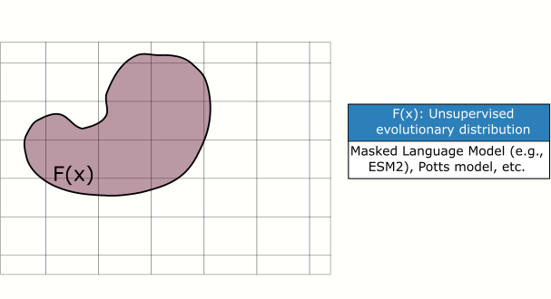

# Gradient-based Discrete MCMC for Directed Evolution

`EvoProtGrad` implements PPDE, the gradient-based discrete MCMC sampler introduced in our [paper](https://doi.org/10.1088/2632-2153/accacd). The source code can be found at `evo_prot_grad/common/sampler.py`, within the [`DirectedEvolution`](https://nrel.github.io/EvoProtGrad/api/common/sampler) class.

PPDE uses gradients of the differentiable product of experts distribution *with respect to the one-hot-encoded input sequence $X$* to propose mutations (amino acid substitutions) during each step of MCMC. In other words, PPDE abuses PyTorch's autodiff to approximately answer the query "given the current protein variant, what amino acid substitution will maximally increase the product of experts score?" *without actually having to try every possible amino acid substitution*. This is a huge computational savings, especially when the number of possible amino acid substitutions is large. We note that this is not the typical use of autodiff, which is usually used for computing gradients of a loss function with respect to *model parameters* (not model inputs).

Here's a visual illustration of a toy example with two experts $F(X)$ and $G(X)$: 

The dashed and red arrows around the black dot represent possible amino acid substitutions (mutations) that can be made to the current protein variant. The red arrow points in the direction leading to the largest increase in the Product of Experts distribution (i.e., largest gradient magnitude), and is the substitution sampled by the proposal distribution. The process repeats until a maximum number of steps is reached, or a maximum number of mutations is reached (at which point the process can be restarted or terminated).

## Customizing your sampler

We support the following customizations to MCMC sampling, to be provided as arguments to `DirectedEvolution`. See the [API documentation](https://nrel.github.io/EvoProtGrad/api/common/sampler) for more details.

- `max_mutations`: The maximum number of mutations to make to the wild type protein. This is a hard limit, and the sampler will restart the chain after this number of mutations is reached.
- `preserved_regions`: A list of tuples of the form `(start: int, end: int)` that specify regions of the protein sequence that should not be mutated. This is useful for specifying protein domains or other regions of interest.

### Limitations

The MCMC sampler currently only supports substitution mutations and not insertions or deletions.

